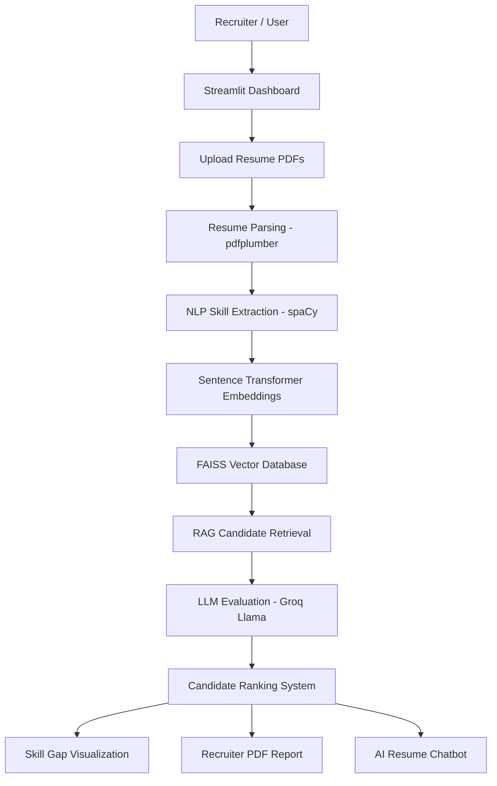

# 🤖 AI Resume Screening Tool

An AI-powered resume screening platform that helps recruiters automatically evaluate and rank candidates using **NLP, RAG, and LLMs**.

The system parses resumes, extracts skills, compares them with job descriptions, ranks candidates, generates recruiter reports, and provides an AI chatbot for querying candidate information.

---

# 🚀 Features

✅ Resume Upload and Parsing  
✅ NLP Skill Extraction  
✅ Candidate Ranking Dashboard  
✅ FAISS Vector Database for Semantic Search  
✅ RAG-based Candidate Retrieval  
✅ LLM Evaluation using Groq (Llama Models)  
✅ Skill Gap Visualization  
✅ Recruiter Report Generation (PDF)  
✅ AI Resume Chatbot  
✅ Interactive Streamlit Web Dashboard

---

# 🧠 System Architecture

DataFlow Diagram
Resume PDFs
│
▼
PDF Parser
│
▼
Text Extraction
│
▼
Skill Extraction (NLP)
│
▼
Sentence Embedding Model
│
▼
FAISS Vector Index
│
▼
RAG Retrieval (Top Candidates)
│
▼
LLM Evaluation (Groq Llama)
│
▼
Candidate Score + Skills Analysis
│
▼
Streamlit Dashboard
│
├── Leaderboard
├── Skill Gap Chart
├── PDF Recruiter Report
└── AI Resume Chatbot
